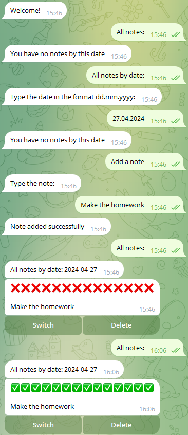

# Telegram Bot ToDo

## Overview

A simple telegram bot for planning and making to-do lists running on python with aiogram library.

## Features

- **MongoDB Integration**: Integration with MongoDB for efficient storage and retrieval of notes.
- **PyMongo Library**: Utilizes pymongo as the library for connecting to MongoDB.
- **Scalability**: Designed with scalability in mind to handle a growing number of users and notes.

## Installation

1. Clone the repository: `git clone https://github.com/idkhtoc/telegram-bot-todo.git`
2. Navigate to the project directory: `cd telegram-bot-todo`
3. Create a virtual environment in this directory.
4. Create a `CONFIG.json` file in the root directory and define the following variables:
  - "API_TOKEN": "Token of the bot made in BotFather",
  - "DB_URL": "Url to connect to your mongoDB cluster",
  - "DB_NAME": "Name of the database"
5. Start the bot by running the `main.py` file.

## Contributing

Contributions are welcome! If you have any suggestions, bug fixes, or new features to add, please feel free to open an issue or submit a pull request.

## License

This project is licensed under the MIT License - see the [LICENSE](LICENSE) file for details.

## Contact

For any inquiries or feedback, please contact me via email: oleksandr.yanov.eu@gmail.com.
